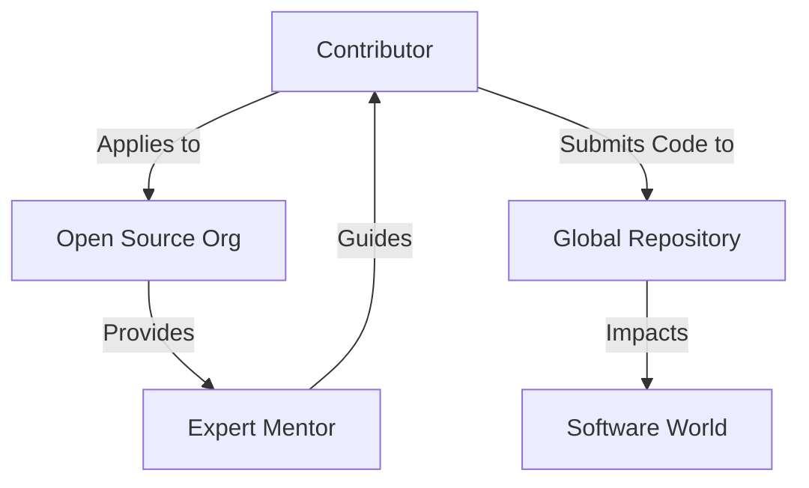

**Google Summer of Code 2026 (GSoC 2026)** offers aspiring developers a **paid opportunity** to contribute to real-world open-source projects while learning directly from expert mentors. With **22+ years of experience**, Google has mentored **25,000+ contributors worldwide since 2005**, making GSoC one of the most **trusted and career-shaping programs** in the tech ecosystem.

<!-- truncate -->

Participants can earn stipends up to **$3,000 (₹2.5 lakh+ for Indian contributors)** while gaining hands-on experience in production-level software development.

:::info
As an authoritative initiative from Google Open Source, details are reliably shared on **summerofcode.withgoogle.com**, making GSoC 2026 a trustworthy pathway for students and beginners to code, learn, and earn stipends up to $3,000 (₹2.5 lakh+ for Indians).
:::

## What is Google Summer of Code 2026?

**Google Summer of Code 2026** is a global program pairing contributors with open-source organizations for 12-22 week paid coding projects. Unlike hackathons, it focuses on production-level contributions in areas like AI, web dev, cybersecurity, and blockchain. 

### Program Structure



---

## GSoC 2026 Registration Dates and Timeline

Mark your calendars! The official timeline ensures you don't miss a single milestone.

| Phase | Dates (2026) | Key Actions |
| --- | --- | --- |
| **Org Applications** | Jan 19 – Feb 3 | Orgs apply; explore past ones |
| **Orgs Announced** | Feb 19 | GSoC organizations 2026 list out |
| **Community Bonding** | Feb 19 – Mar 15 | Discuss ideas, small contributions |
| **GSoC Registration** | Mar 16 – Mar 31 | Submit proposals (GSoC registration) |
| **Results** | Apr 30 | Accepted contributors revealed |
| **Coding Begins** | May 25 | 12-week standard period starts |

---

## GSoC Eligibility: Who Can Apply?

GSoC eligibility is inclusive, targeting newcomers. No college degree has been needed since 2022.

* **Age:** 18+ by registration (Mar 16).
* **Experience:** Newcomers to open source; veterans are often ineligible.
* **Commitment:** 175 hours (Medium) or 350 hours (Large) projects.
* **Skills:** Basic programming (Python, C++, JS); passion over perfection.

:::tip
Tier-2/3 college students thrive here. Women and underrepresented groups get extra support through various diversity initiatives.
:::

---

## GSoC Stipend and Benefits

The stipend is calculated based on your location (Purchasing Power Parity).

### Stipend Breakdown

For Indian contributors, the stipend usually follows this math:

<Tabs>
<TabItem value="stipend" label="Stipend" default>
$750 - $3,000 USD based on country. Paid in two installments.
</TabItem>
<TabItem value="career" label="Career Growth">
70% of contributors get full-time offers from orgs or alumni networks.
</TabItem>
<TabItem value="perks" label="Perks">
Digital certificates, GitHub credibility, and exclusive Google swag (sometimes!).
</TabItem>
</Tabs>

---

## Step-by-Step GSoC Registration Guide

### 1. Explore Organizations

Browse the list on [gsocorganizations.dev](https://gsocorganizations.dev).

### 2. Multi-language Support

Ensure you are proficient in the language used by your target org:

<Tabs>
<TabItem value="py" label="Python (AI/ML)">

```py
# Common in TensorFlow or SciPy
def contribute_to_open_source():
    print("Writing a winning proposal...")

```

</TabItem>
<TabItem value="js" label="JavaScript (Web)">

```js
// Common in Mozilla or React-based orgs
const applyGSoC = () => {
  console.log("Submitting PR #1");
};

```

</TabItem>
</Tabs>

### 3. Craft Your Proposal

A good proposal should be 1,500–2,500 words. Use a clean structure:

```jsx {1,5,10} showLineNumbers
// Proposal Template Structure
const Proposal = {
  header: "Project Title & Contact Info",
  abstract: "Brief summary of the goal",
  timeline: "Week 1 to Week 12 breakdown",
  deliverables: "What will be finished?",
  experience: "Why you are the best fit"
};

```

---

## Preparation Tips for Success

1. **Start Early:** Join Discord/Slack channels in January.
2. **Good First Issues:** Look for these labels on GitHub.
3. **Communication:** Be proactive with mentors.

<BrowserWindow minHeight={200}>
<div style={{textAlign: 'center', padding: '20px'}}>
<h3>Ready to Register?</h3>
<p>Visit the official portal to start your journey.</p>
<button onClick={() => window.open('https://summerofcode.withgoogle.com/', '_blank')} style={{padding: '10px 20px', backgroundColor: '#4285F4', color: 'white', border: 'none', borderRadius: '5px', cursor: 'pointer'}}>Go to GSoC Portal</button>
</div>
</BrowserWindow>

---

## Challenges and How to Overcome

:::caution
**Intense Workload:** Balancing GSoC with college exams can be tough. Create a buffer in your proposal timeline for exam weeks.
:::

:::danger
**Plagiarism:** Copying someone else's proposal will lead to an immediate ban. Always write your own content.
:::

---

## Conclusion: Register for Google Summer of Code 2026 Now

Google Summer of Code 2026 transforms beginners into open-source pros with stipends, experience, and networks. From the registration date in March, secure your spot.

:::success
**Apply for Google Summer of Code 2026** and code your future. Share your org picks in the comments below!
:::

**Google Summer of Code 2026** is a life-changing opportunity to:
- Learn real-world software development
- Earn a global stipend
- Build an open-source career

Start preparing **today**, and turn your coding skills into impact.